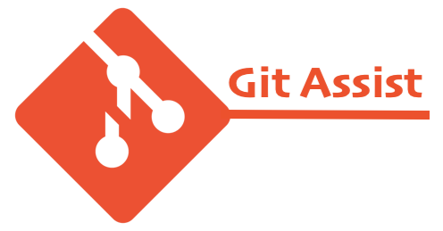

# Git Assist

Git Assist is designed as a set of command line tools that can assist your daily work on git and GitHub use.

* To learn more on Git Assist, please read [What is Git Assist?](docs/what-is-git-assist.md).
* To learn how to install and run Git Assist, please read [Getting Started](docs/getting-started.md).
* To learn how many commands that Git Assist supports, and what problem that each command resolves, please read [Commands](docs/commands.md).
* To learn how to contribute, please read [Contributing](docs/contributing.md).

